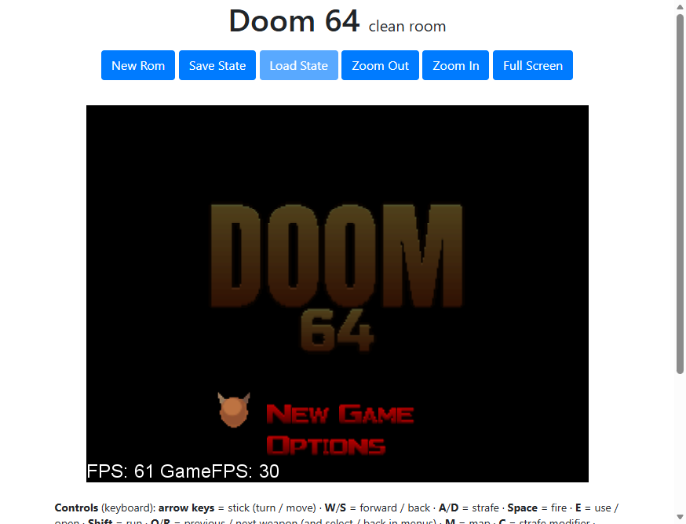
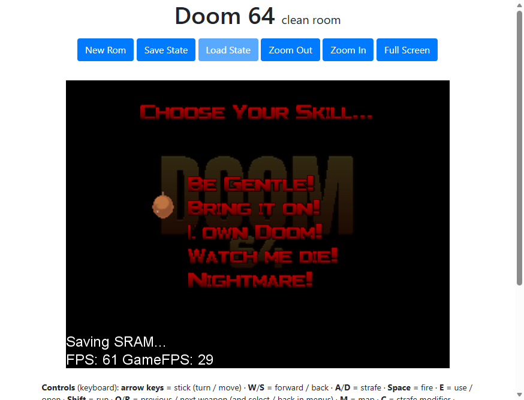
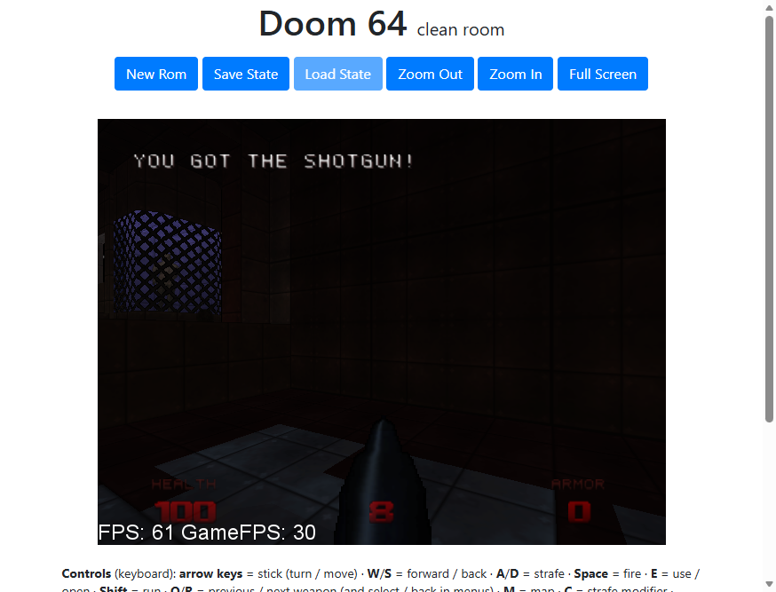
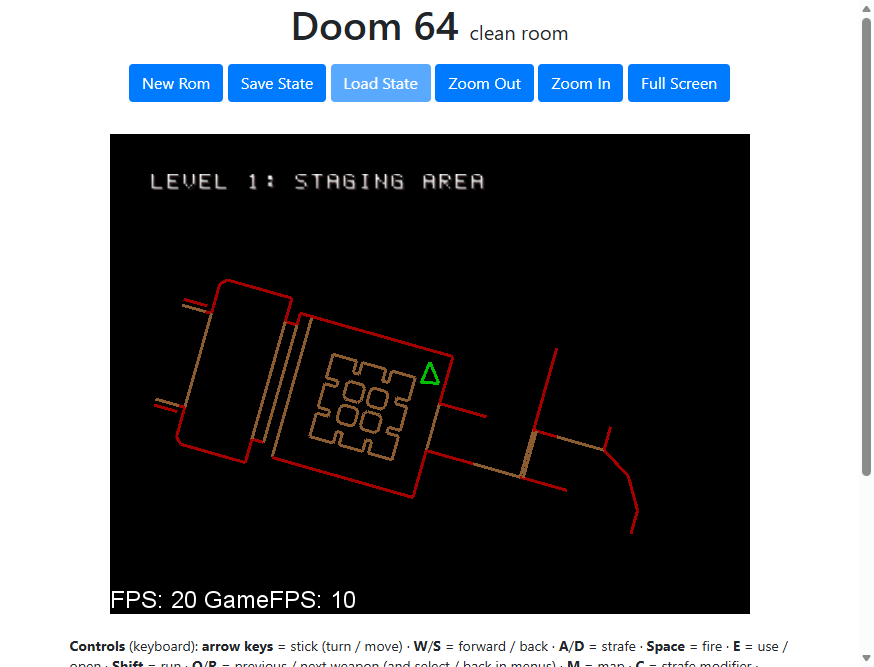
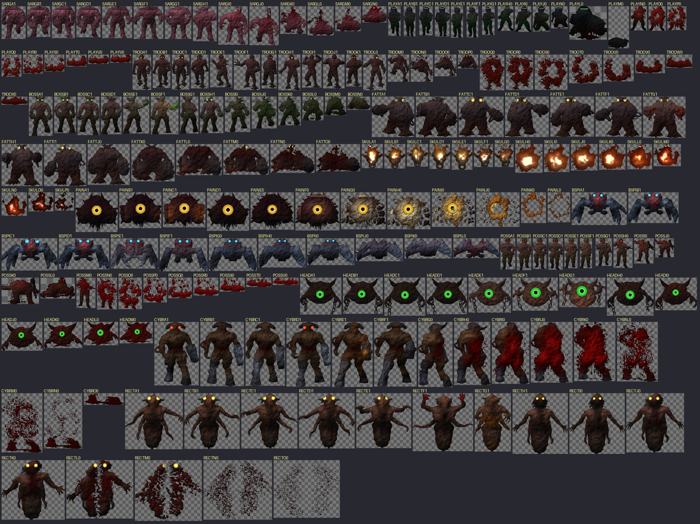

# Doom 64 — clean room web build

Play: **https://andrewnakas.github.io/doom64-cleanroom/**

Doom 64 built from the [DOOM64-RE](https://github.com/Erick194/DOOM64-RE) reverse engineering (Erick194, GPL-3)
with an SDK-free toolchain, where every asset the game reads from its data files is **regenerated**:

- **Sprites** (947 frames: monsters, weapons, items, effects), **wall/floor textures** (503), skies, fonts,
  menu symbols, HUD icons and full-screen pictures are generated from coarse facts only — size, format,
  a 4x4 colour grid (16x16 for images of 128 px and up) and a 2-bit alpha outline — or drawn from scratch
  (title, credits and legal screens re-typeset with OFL fonts; demon-skull cursor, buttons and keys drawn
  as shapes). Palettes are fitted to our images; palette variants (spectres, player colours, switch states)
  follow a 3x4 colour matrix fact.
- **Samples** (124 instruments and sound effects) are resynthesised from length, rate, loop points, median
  pitch and a coarse spectral outline; ADPCM codebooks and loop states are recomputed from our audio.
- **Kept as facts** (not art): game code (the decomp), level data (maps: geometry, things, sector colours),
  music note sequences, instrument/patch tables, demo inputs, text. Kept as code: the IPL3 boot code,
  RSP microcode and libultra ([ultralib](https://github.com/decompals/ultralib)).

No original pixels or samples are included; a taint scan (`games/doom64/taint.py`, dev only) checks the
clean data against retail (byte windows, image detail correlation, audio cross-correlation).

| Title menu | Skill select | In game | Automap |
|---|---|---|---|
|  |  |  |  |

Regenerated monster sprites (front frames, with drawn eyes):

## How it is built

`sh games/doom64/build_all.sh <your Doom 64 (USA) z64>`:

1. `extract_rom.py` (dirty room) splits your ROM: WAD/WMD/WSD/WDD, lumps (decompressed with the decomp's
   own decoders), and the code facts (IPL3, RSP ucode).
2. `spec_extract.py`, `audio_spec.py` (dirty room) reduce them to coarse facts (`spec/`).
3. `generate.py` + `drawn.py` + `audio_gen.py` (clean room) regenerate every lump and sample from `spec/`.
4. `build_rom.py` compiles DOOM64-RE and ultralib with libdragon's mips64-elf GCC, links with our entry
   stub and linker script (no makerom) and packs a ROM (data stored uncompressed).
5. `ports/emu/make_site.py` wraps the ROM in [N64Wasm](https://github.com/nbarkhina/N64Wasm) (MIT).

Formats: `wadfmt.py` (sprites, textures, pictures, palettes; TMEM odd-row swizzle; tile restarts),
`wessfmt.py` (WESS module: patches, sample table, books, loops; VADPCM).

Fonts: Russo One and Anton (SIL Open Font License, `games/doom64/fonts/OFL.txt`).
Doom and Doom 64 are trademarks of id Software; this is a non-commercial fan preservation project.
